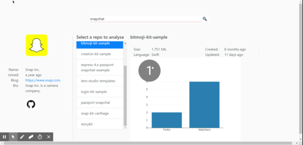

# Github Access - CS3012

My github access web app accepts a github profile name from the user and loads data using axios from the github api and stores it as a json object.

It displays numerous details about the queried github profile including name, location, bio, followers, following etc.

It also displays a list of their repos and displays two graphs based on these repos. They are as follows:

  
**Graph 1** - A pie chart that displays the size of all the repos in comparison to one another. This is an example of an older software metric as discussed in my report.

  
**Graph 2** - A bar chart that displays the amount of users watching and users who have forked each repo. This demonstrates the social influence of the repo, which is a newer software metric and is also discussed in my report.

  
The web app uses reactJS and bootstrap in order to make the UI.

#
# Running the App
In order to run the app just clone the repo and type:
 ### `npm start`

This runs the app in the development mode.  
Open  [http://localhost:3000](http://localhost:3000/)  to view it in the browser.

The page will reload if you make edits.  
